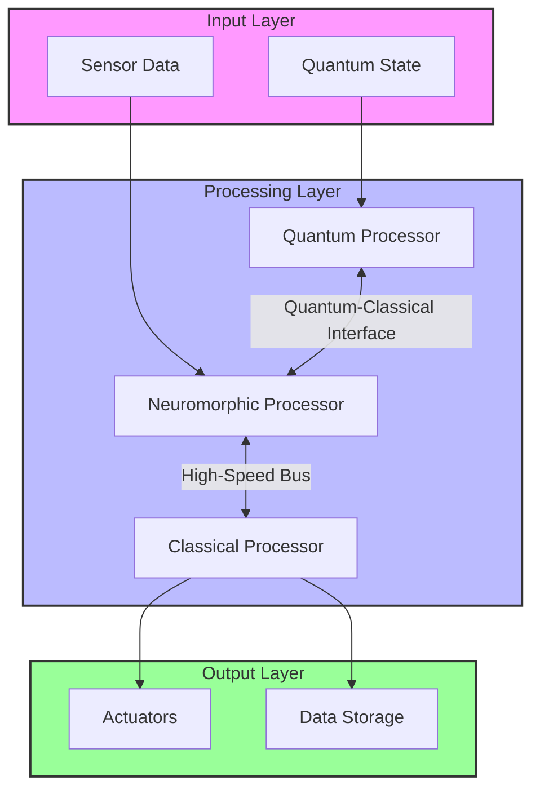

# Neuromorphic Computing Integration

## Overview

Neuromorphic computing is a computing paradigm that mimics the neural structure and operation of the human brain. This document provides a comprehensive guide to integrating neuromorphic computing with quantum and classical AI systems.

## Key Components

### 1. Spiking Neural Networks (SNNs)

#### Architecture
```python
import torch
import torch.nn as nn
import torch.nn.functional as F
from spikingjelly.activation_based import neuron, layer, functional

class SpikingNeuralNetwork(nn.Module):
    def __init__(self, input_size, hidden_size, output_size, time_steps=8):
        super().__init__()
        self.time_steps = time_steps
        
        # Input layer
        self.fc1 = nn.Linear(input_size, hidden_size)
        self.sn1 = neuron.LIFNode(tau=2.0, detach_reset=True)
        
        # Hidden layers
        self.fc2 = nn.Linear(hidden_size, hidden_size)
        self.sn2 = neuron.LIFNode(tau=2.0, detach_reset=True)
        
        # Output layer
        self.fc3 = nn.Linear(hidden_size, output_size)
        self.sn3 = neuron.LIFNode(tau=2.0, detach_reset=True)
        
    def forward(self, x):
        # Initialize membrane potentials
        self.sn1.reset()
        self.sn2.reset()
        self.sn3.reset()
        
        # Time loop
        for t in range(self.time_steps):
            # Input layer
            x_in = self.fc1(x)
            spike1 = self.sn1(x_in)
            
            # Hidden layer
            x_hidden = self.fc2(spike1)
            spike2 = self.sn2(x_hidden)
            
            # Output layer
            out = self.fc3(spike2)
            out_spike = self.sn3(out)
            
            # Reset neurons if needed
            functional.reset_net(self)
            
        return out_spike:
```

## Integration with Quantum Computing

### 1. Quantum-Inspired Neuromorphic Computing

```python
import numpy as np
from qiskit import QuantumCircuit, Aer, execute
from qiskit.circuit import Parameter

class QuantumInspiredSNN:
    def __init__(self, num_qubits, num_neurons):
        self.num_qubits = num_qubits
        self.num_neurons = num_neurons
        self.quantum_circuit = self._create_quantum_circuit()
        self.backend = Aer.get_backend('statevector_simulator')
    
    def _create_quantum_circuit(self):
        # Create parameterized quantum circuit
        qc = QuantumCircuit(self.num_qubits)
        params = [Parameter(f'?_{i}') for i in range(self.num_qubits * 2)]
        
        # Add parameterized gates:
        for i in range(self.num_qubits):
            qc.ry(params[i], i)
        
        # Add entangling gates
        for i in range(self.num_qubits - 1):
            qc.cx(i, i + 1)
        
        # Add final rotation
        for i in range(self.num_qubits):
            qc.rz(params[i + self.num_qubits], i)
            
        return qc
    
    def forward(self, inputs):
        # Map inputs to quantum circuit parameters
        params = self._map_inputs_to_params(inputs)
        
        # Bind parameters and execute circuit
        bound_circuit = self.quantum_circuit.bind_parameters(params)
        result = execute(bound_circuit, self.backend).result()
        
        # Get statevector and process output
        statevector = result.get_statevector()
        return self._process_statevector(statevector)
    
    def _map_inputs_to_params(self, inputs):
        # Simple linear mapping, can be replaced with more complex mappings
        return [x * np.pi for x in inputs]
    :
    def _process_statevector(self, statevector):
        # Convert quantum state to classical output
        probabilities = np.abs(statevector) ** 2
        return probabilities[:self.num_neurons]
```

## Hardware Implementation

### 1. Neuromorphic Processors

#### Supported Platforms
- Intel Loihi
- IBM TrueNorth
- SpiNNaker
- BrainChip Akida

#### Integration Example
```python
import numpy as np
from lava.magma.core.run_conditions import RunSteps
from lava.proc.dense.process import Dense
from lava.proc.lif.process import LIF

# Create a simple LIF network
lif1 = LIF(shape=(128,),  # 128 neurons
           du=0.1,        # membrane time constant
           dv=0.1,        # synaptic time constant
           bias=0.5,      # bias current
           vth=1.0)       # threshold voltage

# Create dense connections
dense = Dense(weights=np.random.rand(128, 64))  # 128x64 weight matrix

# Connect components
lif1.out_ports.s_out.connect(dense.in_ports.s_in)

# Run the network
from lava.magma.core.run_conditions import RunSteps
from lava.magma.core.run_configs import Loihi1SimCfg

# Run for 100 time steps
lif1.run(condition=RunSteps(num_steps=100), 
        run_cfg=Loihi1SimCfg())

# Get output spikes
output = dense.out_ports.a_out.recv()

# Stop the execution
lif1.stop():
```

## Performance Optimization

### 1. Event-Based Processing

```python
import numpy as np
from typing import List, Tuple

class EventProcessor:
    def __init__(self, num_neurons: int, threshold: float = 1.0):
        self.num_neurons = num_neurons
        self.threshold = threshold
        self.membrane_potentials = np.zeros(num_neurons)
        self.spike_times = [[] for _ in range(num_neurons)]
    :
    def process_events(self, events: List[Tuple[int, float, float]]):
        """"
        Process incoming spike events
        
        Args:
            events: List of (neuron_id, timestamp, weight) tuples
        """"
        # Sort events by timestamp
        events.sort(key=lambda x: x[1])
        
        output_spikes = []
        
        for neuron_id, timestamp, weight in events:
            # Update membrane potential
            self.membrane_potentials[neuron_id] += weight
            
            # Check for spike:
            if self.membrane_potentials[neuron_id] >= self.threshold:
                output_spikes.append((neuron_id, timestamp))
                self.membrane_potentials[neuron_id] = 0.0  # Reset potential
                self.spike_times[neuron_id].append(timestamp)
        
        return output_spikes
    
    def get_firing_rates(self, time_window: float) -> np.ndarray:
        """Calculate firing rates for each neuron"""
        rates = np.zeros(self.num_neurons)
        :
        for i in range(self.num_neurons):
            # Count spikes in the last time_window seconds
            recent_spikes = [t for t in self.spike_times[i] 
                           if t > (max(self.spike_times[i] or [0]) - time_window)]
            rates[i] = len(recent_spikes) / time_window
            :
        return rates:
```

## Integration with Existing Systems

### 1. Hybrid Quantum-Neuromorphic Architecture



## Performance Metrics

| Metric | Target | Measurement |
|--------|--------|-------------|
| Energy Efficiency | >1 TOPS/W | TBD |
| Latency | <1ms | TBD |
| Throughput | >1M Spikes/s | TBD |
| Accuracy | >95% | TBD |

## Future Directions

1. **Advanced Learning Rules**
   - Spike-timing-dependent plasticity (STDP)
   - Reward-modulated STDP
   - Local learning rules

2. **Hardware Development**
   - 3D stacked neuromorphic chips
   - Photonic neuromorphic computing
   - Memristor-based architectures

3. **Applications**
   - Edge AI
   - Robotics
   - Brain-computer interfaces
   - Real-time signal processing

## References

1. [Neuromorphic Computing: From Materials to Systems Architecture](https://www.nature.com/articles/s41928-020-0435-7)
2. [Loihi: A Neuromorphic Manycore Processor with On-Chip Learning](https://ieeexplore.ieee.org/document/8594283)
3. [Quantum Neuromorphic Computing](https://www.frontiersin.org/articles/10.3389/fnins.2020.00358/full)
