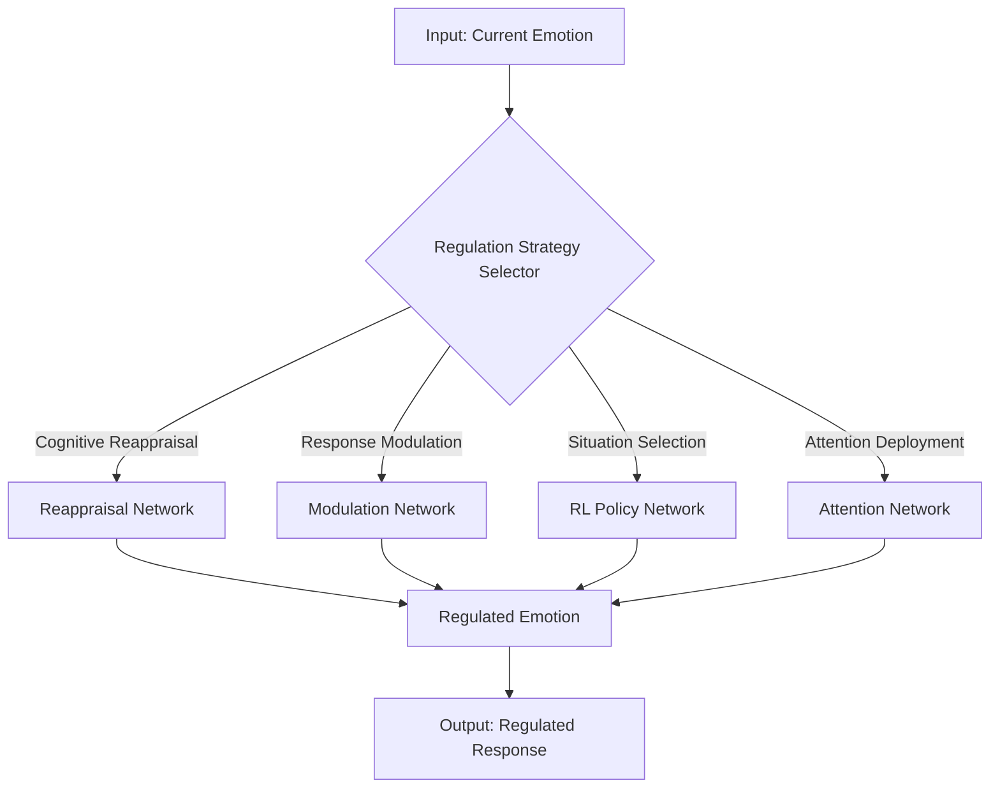

# Emotion Regulation System

## Overview

The Emotion Regulation System is responsible for managing and adapting emotional responses based on context, goals, and social norms. It implements various regulation strategies inspired by psychological theories of emotion regulation.

## Core Components

### 1. Regulation Strategies

#### 1.1 Cognitive Reappraisal
- **Purpose**: Change the emotional impact by reinterpreting the meaning of a situation
- **Implementation**: Neural network that generates alternative appraisals
- **Parameters**:
  - Reinterpretation strength (0.0 to 1.0)
  - Positive/negative bias adjustment
  - Contextual relevance weighting

#### 1.2 Response Modulation
- **Purpose**: Directly modify the intensity of emotional responses
- **Implementation**: Dampening/amplification of emotion vectors
- **Parameters**:
  - Dampening factor (0.0 to 1.0)
  - Emotion-specific modulation weights
  - Temporal smoothing factor

#### 1.3 Situation Selection
- **Purpose**: Choose environments or situations that influence emotional states
- **Implementation**: Reinforcement learning for optimal situation selection
- **Parameters**:
  - Exploration/exploitation balance
  - Long-term vs. short-term reward weighting
  - Social context consideration

#### 1.4 Attention Deployment
- **Purpose**: Direct attention to modify emotional experience
- **Implementation**: Attention mechanisms over emotional features
- **Parameters**:
  - Attention window size
  - Focus shifting rate
  - Salience thresholds

### 2. Regulation Network

#### 2.1 Architecture


#### 2.2 Hyperparameters
```yaml
regulation_network:
  learning_rate: 0.001
  hidden_dim: 256
  num_layers: 3
  dropout: 0.2
  temperature: 0.7  # For softmax sampling
  
strategy_selection:
  exploration_rate: 0.1
  strategy_weights:  # Initial weights for each strategy
    cognitive_reappraisal: 0.3
    response_modulation: 0.4
    situation_selection: 0.2
    attention_deployment: 0.1
```

## Data Structures

### 1. Regulation Context
```python
{
    'current_emotion': {
        'vector': List[float],  # 24-dimensional emotion vector
        'intensity': float,     # 0.0 to 1.0
        'dominant_emotion': str  # Name of dominant emotion
    },
    'target_emotion': {
        'vector': List[float],  # Desired emotion state
        'intensity_range': Tuple[float, float],  # Min/max desired intensity
        'priority': float       # 0.0 to 1.0
    },
    'context': {
        'environment': str,     # Current environment
        'social_context': str,  # Social setting
        'time_constraints': float,  # 0.0 (none) to 1.0 (urgent)
        'energy_level': float   # 0.0 to 1.0
    },
    'regulation_history': [
        {
            'strategy': str,
            'effectiveness': float,
            'timestamp': str
        }
    ]
}
```

### 2. Regulation Result
```python
{
    'regulated_emotion': {
        'vector': List[float],  # Regulated emotion vector
        'intensity': float,     # Resulting intensity
        'change_magnitude': float  # Absolute change from original
    },
    'strategy_used': str,       # Name of applied strategy
    'confidence': float,        # 0.0 to 1.0
    'energy_cost': float,       # 0.0 to 1.0
    'side_effects': List[str],  # Any unintended consequences
    'metadata': {
        'processing_time_ms': int,
        'model_version': str
    }
}
```

## API Reference

### 1. Core Functions

#### `regulate_emotion(emotion, context, strategy=None)`
Regulate the given emotional state based on context.

**Parameters:**
- `emotion` (dict): Current emotional state
- `context` (dict): Current context and goals
- `strategy` (str, optional): Specific strategy to use

**Returns:**
- dict: Regulation result with new emotional state

#### `evaluate_regulation_effectiveness(original, regulated, context)`
Evaluate how effective the regulation was.

**Parameters:**
- `original` (dict): Original emotional state
- `regulated` (dict): Regulated emotional state
- `context` (dict): Context of regulation

**Returns:**
- float: Effectiveness score (0.0 to 1.0)

### 2. Strategy-Specific Functions

#### `apply_cognitive_reappraisal(emotion, context)`
Apply cognitive reappraisal strategy.

#### `apply_response_modulation(emotion, intensity_factor)`
Modulate emotional response intensity.

#### `select_optimal_situation(emotion, available_options)`
Choose best situation from available options.

## Implementation Details

### 1. Neural Network Architecture

```python
class RegulationNetwork(nn.Module):
    def __init__(self, input_dim, hidden_dim, output_dim):
        super().__init__()
        self.encoder = nn.Sequential(
            nn.Linear(input_dim, hidden_dim),
            nn.LeakyReLU(),
            nn.LayerNorm(hidden_dim)
        )
        self.strategy_predictor = nn.Sequential(
            nn.Linear(hidden_dim, hidden_dim // 2),
            nn.LeakyReLU(),
            nn.Linear(hidden_dim // 2, 4)  # 4 strategy types
        )
        self.regulator = nn.Sequential(
            nn.Linear(hidden_dim + 4, hidden_dim),  # +4 for strategy one-hot
            nn.LeakyReLU(),
            nn.Linear(hidden_dim, output_dim),
            nn.Softmax(dim=-1)
        )
    
    def forward(self, x, strategy_idx=None):
        encoded = self.encoder(x)
        strategy_logits = self.strategy_predictor(encoded)
        
        if strategy_idx is None:
            strategy = F.gumbel_softmax(strategy_logits, tau=1, hard=False)
        else:
            strategy = F.one_hot(
                torch.tensor([strategy_idx]), 
                num_classes=4
            ).float().to(x.device)
        
        strategy_expanded = strategy.expand(encoded.size(0), -1)
        regulated = self.regulator(
            torch.cat([encoded, strategy_expanded], dim=-1)
        )
        
        return {
            'regulated_emotion': regulated,
            'strategy_logits': strategy_logits,
            'strategy': strategy
        }
```

### 2. Training Process

1. **Data Collection**:
   - Collect examples of emotional states and their regulated versions
   - Include context information and strategy used

2. **Loss Function**:
   ```python
   def regulation_loss(predicted, target, strategy_used):
       # Emotion prediction loss
       emotion_loss = F.mse_loss(predicted['regulated_emotion'], target)
       
       # Strategy prediction loss
       strategy_loss = F.cross_entropy(
           predicted['strategy_logits'], 
           strategy_used
       )
       
       # Regularization
       l2_reg = torch.tensor(0.)
       for param in model.parameters():
           l2_reg += torch.norm(param)
           
       return emotion_loss + 0.1 * strategy_loss + 0.001 * l2_reg
   ```

3. **Training Loop**:
   ```python
   def train_epoch(model, dataloader, optimizer, device):
       model.train()
       total_loss = 0
       
       for batch in dataloader:
           # Move batch to device
           emotion = batch['emotion'].to(device)
           target = batch['target_emotion'].to(device)
           strategy = batch['strategy'].to(device)
           
           # Forward pass
           output = model(emotion, strategy)
           
           # Calculate loss
           loss = regulation_loss(output, target, strategy)
           
           # Backward pass
           optimizer.zero_grad()
           loss.backward()
           optimizer.step()
           
           total_loss += loss.item()
       
       return total_loss / len(dataloader)
   ```

## Performance Metrics

1. **Regulation Accuracy**:
   - Percentage of cases where regulation moved emotion towards target
   - Measured by cosine similarity between emotion vectors

2. **Strategy Effectiveness**:
   - Average effectiveness score per strategy
   - Context-specific effectiveness

3. **Computational Efficiency**:
   - Average processing time per regulation
   - Memory usage

## Usage Examples

### Basic Regulation
```python
from emotion_regulation.regulator import EmotionRegulator

# Initialize regulator
regulator = EmotionRegulator()

# Current emotional state
emotion = {
    'vector': [0.8, 0.6, 0.4, ...],  # 24D vector
    'intensity': 0.75,
    'dominant_emotion': 'frustration'
}

# Context and goals
context = {
    'target_emotion': {
        'vector': [0.6, 0.4, 0.5, ...],  # More calm state
        'intensity_range': (0.3, 0.6),
        'priority': 0.8
    },
    'environment': 'work_meeting',
    'social_context': 'professional',
    'time_constraints': 0.7,
    'energy_level': 0.6
}

# Regulate emotion
result = regulator.regulate_emotion(emotion, context)
print(f"Regulated emotion: {result['regulated_emotion']['dominant_emotion']}")
print(f"Strategy used: {result['strategy_used']}")
print(f"Effectiveness: {result['effectiveness']:.2f}")
```

### Strategy-Specific Regulation
```python
# Force using cognitive reappraisal
result = regulator.regulate_emotion(
    emotion,
    context,
    strategy='cognitive_reappraisal'
)

# Check side effects
if result['side_effects']:
    print(f"Side effects: {', '.join(result['side_effects'])}")
```

## Best Practices

1. **Context Awareness**:
   - Always provide rich context for better regulation
   - Update context frequently as situation changes

2. **Strategy Selection**:
   - Let the system choose strategy by default
   - Override only when specific regulation is needed

3. **Monitoring**:
   - Regularly evaluate regulation effectiveness
   - Monitor for regulation fatigue

4. **Fallback Mechanisms**:
   - Implement graceful degradation
   - Have default strategies for edge cases

## Troubleshooting

### Common Issues

1. **Ineffective Regulation**
   - Check if context is properly specified
   - Verify emotion vectors are normalized
   - Try different strategy weights

2. **Slow Performance**
   - Reduce model size if possible
   - Batch process emotions when possible
   - Use lower precision (FP16) if supported

3. **Unintended Side Effects**
   - Review strategy weights
   - Check for conflicting goals
   - Verify emotion vector dimensions

## Future Improvements

1. **Adaptive Strategies**:
   - Learn optimal strategies per context
   - Personalize based on user feedback

2. **Multimodal Integration**:
   - Combine with physiological signals
   - Incorporate facial expression analysis

3. **Long-term Adaptation**:
   - Track regulation effectiveness over time
   - Adapt to changing personal and social contexts
