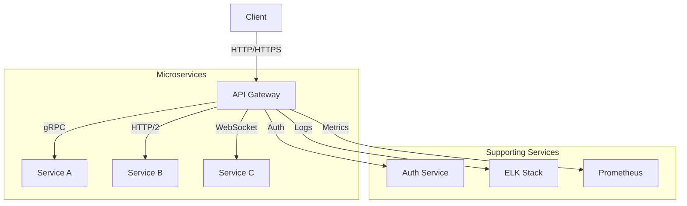

# API Gateway

## Overview

The API Gateway serves as the single entry point for all client requests to our microservices architecture. It handles request routing, composition, and protocol translation, providing a unified API to clients.

## Key Features

### 1. Request Routing
- **Path-based routing** to appropriate microservices
- **Content-based routing** based on headers or payload
- **Load balancing** across service instances
- **Service discovery** integration

### 2. Security
- **Authentication & Authorization**
  - JWT validation
  - OAuth 2.0 / OpenID Connect
  - API key management
- **Rate limiting** and throttling
- **IP whitelisting/blacklisting**
- **CORS** configuration

### 3. Transformation
- **Protocol translation** (HTTP/gRPC/WebSockets)
- **Request/response transformation**
- **Payload validation** against OpenAPI/Swagger schemas
- **Header manipulation**

### 4. Monitoring & Analytics
- Request/response logging
- Performance metrics collection
- Error tracking and alerting
- API usage analytics

## Architecture



## Implementation

### Technology Stack
- **API Gateway**: Kong/NGINX/Envoy
- **Service Mesh**: Istio/Linkerd
- **Authentication**: Keycloak/Auth0
- **Monitoring**: Prometheus, Grafana, ELK Stack
- **Deployment**: Kubernetes, Docker

### Configuration Example

```yaml
# Example Kong API Gateway Configuration
services:
  - name: user-service
    url: http://user-service:8000
    routes:
      - name: user-routes
        paths: ['/users', '/users/me']
        methods: [GET, POST, PUT, DELETE]
        strip_path: true
        plugins:
          - name: rate-limiting
            config:
              minute: 100
              policy: local
          - name: jwt
            config:
              key_claim_name: kid
              claims_to_verify: [exp]
```

## Best Practices

### Security
1. Always use HTTPS
2. Implement proper authentication and authorization
3. Apply the principle of least privilege
4. Regularly rotate API keys and certificates
5. Implement request validation

### Performance
1. Enable response caching where appropriate
2. Implement circuit breakers for fault tolerance
3. Use connection pooling
4. Compress responses when possible
5. Implement proper timeouts and retries

### Observability
1. Log all requests and responses
2. Track API usage metrics
3. Set up alerts for error rates and latency
4. Use distributed tracing

## Common Patterns

### API Versioning
```
/api/v1/resource
/api/v2/resource
```

### Error Handling
```json
{
  "error": {
    "code": "INVALID_REQUEST",
    "message": "Invalid request parameters",
    "details": {
      "field": "email",
      "issue": "Invalid email format"
    },
    "request_id": "req_123456789"
  }
}
```

## Monitoring & Maintenance

### Key Metrics to Monitor
- Request rate
- Error rate (4xx, 5xx)
- Latency (p50, p95, p99)
- System resources (CPU, memory, network)
- Cache hit/miss ratio

### Maintenance Tasks
1. Regular security patches
2. Certificate rotation
3. Configuration updates
4. Performance tuning
5. Capacity planning

## References

- [Kong API Gateway Documentation](https://docs.konghq.com/)
- [API Gateway Pattern](https://microservices.io/patterns/apigateway.html)
- [OAuth 2.0](https://oauth.net/2/)
- [OpenAPI Specification](https://swagger.io/specification/)

## Revision History

| Version | Date | Author | Changes |
|---------|------|--------|---------|
| 2.0.0 | 2025-07-05 | API Team | Complete documentation |
| 1.0.0 | 2025-07-04 | System | Initial stub |
