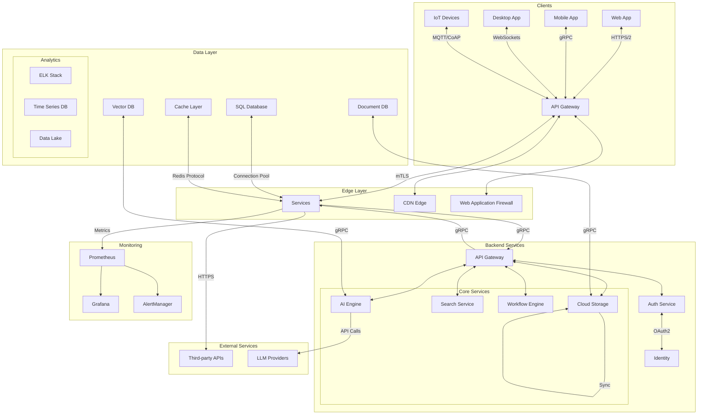
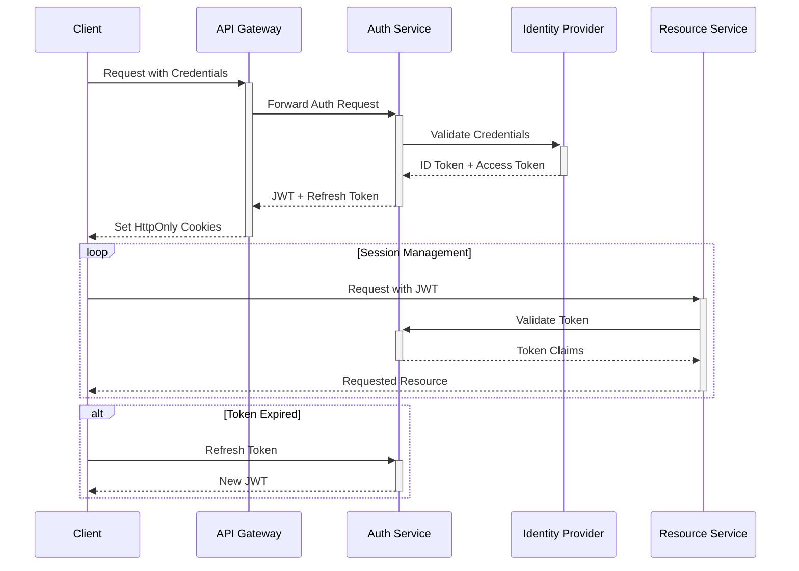

# Unified AI Assistant: Production Architecture

## Overview

This document provides a comprehensive overview of the production-grade architecture for the Unified AI Assistant - a sophisticated, cross-platform, multimodal system that integrates all components from the knowledge base into a single, cohesive product. The architecture is designed for scalability, reliability, and security while maintaining flexibility for future enhancements.

## System Architecture

### High-Level Architecture

The system follows a microservices architecture with clear separation of concerns, enabling independent scaling and deployment of components. The architecture is built on cloud-native principles and leverages containerization for consistent deployment across environments.

### Core Components

#### 1. AI Engine

The AI Engine serves as the brain of the system, providing advanced AI capabilities:

- **Natural Language Processing**
  - Intent recognition and entity extraction
  - Contextual understanding and conversation management
  - Sentiment analysis and emotion detection
  - Multilingual support with automatic translation

- **Machine Learning Services**
  - Model training and inference pipelines
  - Transfer learning for domain adaptation
  - Continuous learning from user interactions
  - Model versioning and A/B testing

- **Knowledge Integration**
  - Vector database for semantic search (Pinecone, Weaviate)
  - Document processing and information extraction
  - Knowledge graph construction and traversal
  - Real-time knowledge updates

- **Multimodal Processing**
  - Text analysis and generation (GPT-4, Claude, etc.)
  - Image understanding and generation (DALL-E, Stable Diffusion)
  - Speech recognition and synthesis
  - Video analysis and processing

#### 2. Networking Layer

The networking infrastructure ensures secure and efficient communication:

- **Secure Communication**
  - End-to-end encryption for all data in transit
  - Mutual TLS for service-to-service communication
  - Secure WebSockets for real-time updates
  - Network segmentation and micro-segmentation

- **Performance Optimization**
  - Global load balancing with Anycast
  - Intelligent routing and traffic management
  - Connection pooling and keep-alive optimization
  - Protocol optimization (HTTP/3, gRPC, WebRTC)

- **Monitoring and Diagnostics**
  - Real-time network performance metrics
  - Distributed tracing for request flows
  - Anomaly detection and alerting
  - Network topology visualization

#### 3. Security Services

Comprehensive security measures protect the system and its data:

- **Identity and Access Management**
  - OAuth 2.0 and OpenID Connect integration
  - Multi-factor authentication
  - Role-based access control (RBAC)
  - Just-in-time access provisioning

- **Data Protection**
  - Field-level encryption for sensitive data
  - Hardware security modules (HSM) for key management
  - Data anonymization and pseudonymization
  - Automated data classification and handling

- **Threat Protection**
  - Web application firewall (WAF)
  - DDoS protection and mitigation
  - Intrusion detection and prevention (IDS/IPS)
  - Security information and event management (SIEM)

#### 4. Database Services

Robust data storage and retrieval capabilities:

- **Vector Database**
  - High-performance similarity search
  - Dimensionality reduction and indexing
  - Hybrid search combining semantic and keyword approaches
  - Multi-tenant data isolation

- **Document Store**
  - Schema-flexible document storage
  - Full-text search capabilities
  - Versioned document storage
  - Advanced querying and aggregation

- **Relational Database**
  - ACID-compliant transactions
  - Complex query optimization
  - Data consistency and integrity
  - Connection pooling and performance tuning

- **Caching Layer**
  - Distributed in-memory caching
  - Cache invalidation strategies
  - Multi-level caching hierarchy
  - Cache warming and pre-fetching

### Cross-Platform Clients

The system supports multiple client platforms, each optimized for its specific use case while maintaining a consistent user experience:

1. **Web Application**
   - **Technology Stack**
     - React 18+ with TypeScript
     - Next.js for server-side rendering and static generation
     - Tailwind CSS for responsive design
     - Redux Toolkit for state management
   - **Key Features**
     - Progressive Web App (PWA) capabilities
     - Responsive design with mobile-first approach
     - Real-time updates via WebSockets
     - Service worker for offline functionality
   - **Performance Optimization**
     - Code splitting and lazy loading
     - Image optimization and lazy loading
     - Client-side caching strategies
     - Performance monitoring with RUM

2. **Mobile Application**
   - **Technology Stack**
     - React Native with TypeScript
     - Expo for cross-platform development
     - React Navigation for routing
     - Realm for local storage
   - **Platform-Specific Features**
     - iOS and Android native modules
     - Biometric authentication
     - Background sync and processing
     - Camera and sensor integration
   - **Performance Considerations**
     - Optimized bundle size
     - Memory management
     - Battery efficiency
     - Offline-first architecture

3. **Desktop Application**
   - **Technology Stack**
     - Electron with React
     - Node.js integration
     - System API access
     - Native module support
   - **Advanced Capabilities**
     - System tray integration
     - Global shortcuts
     - File system access
     - Background services
   - **Security Features**
     - Sandboxing
     - Context isolation
     - Permission management
     - Secure storage

4. **Smart Devices/IoT**
   - **Supported Platforms**
     - Smart displays
     - Voice assistants
     - Wearable devices
     - Edge computing nodes
   - **Optimization Techniques**
     - Model quantization
     - Hardware acceleration
     - Bandwidth optimization
     - Power management
   - **Edge Computing**
     - On-device inference
     - Federated learning
     - Local data processing
     - Edge caching

## Integration Architecture

The system's integration architecture is designed for flexibility, scalability, and reliability, enabling seamless communication between all components while maintaining security and performance.

### Data Flow

### Authentication Flow

The authentication and authorization system implements a robust, zero-trust security model:

1. **Authentication Process**
   - Client authenticates using OAuth 2.0 with PKCE
   - Identity Provider (IdP) verifies credentials
   - Issues JWT and refresh tokens
   - Tokens include fine-grained permissions

2. **Session Management**
   - Short-lived access tokens (15-60 minutes)
   - Long-lived refresh tokens (7-30 days)
   - Token rotation and revocation
   - Device fingerprinting for security

3. **Authorization**
   - Role-based access control (RBAC)
   - Attribute-based access control (ABAC)
   - Policy as code implementation
   - Just-in-time access provisioning

### Authentication and Authorization Flow

### Data Flow Details

1. **Request Processing**
   - All requests pass through the API Gateway
   - Rate limiting and throttling applied
   - Request validation and transformation
   - Load balancing across service instances

2. **Service Communication**
   - gRPC for internal service communication
   - Protocol Buffers for efficient serialization
   - Service discovery and health checks
   - Circuit breakers and retry policies

3. **Data Consistency**
   - Event-driven architecture with CQRS
   - Event sourcing for critical workflows
   - Saga pattern for distributed transactions
   - Idempotent operations

## Production Readiness

The system is designed with production-grade reliability, security, and maintainability in mind, following industry best practices and compliance requirements.

### Scalability

#### Horizontal Scaling
- Stateless services for easy scaling
- Database sharding and partitioning
- Read replicas for high read throughput
- Caching strategies at multiple levels

#### Vertical Scaling
- Resource profiling and optimization
- Memory management and garbage collection tuning
- Connection pooling and thread management
- Database query optimization

#### Global Distribution
- Multi-region deployment
- Geo-replication of critical data
- CDN integration for static assets
- Latency-based routing

### Security

#### Data Protection
- AES-256 encryption for data at rest
- TLS 1.3 for data in transit
- Hardware Security Modules (HSM) for key management
- Regular security audits and penetration testing

#### Access Control
- Fine-grained permission system
- Attribute-based access control (ABAC)
- Time-bound access tokens
- Audit logging of all sensitive operations

#### Compliance
- GDPR, CCPA, HIPAA compliance
- SOC 2 Type II certification
- Regular compliance audits
- Data residency options

### Reliability

#### Fault Tolerance
- Circuit breakers and bulkheads
- Retry policies with exponential backoff
- Graceful degradation
- Chaos engineering practices

#### High Availability
- Multi-AZ deployment
- Automated failover
- Blue/green deployments
- Zero-downtime updates

#### Monitoring and Alerting
- Distributed tracing
- Real-time metrics collection
- Anomaly detection
- On-call rotation management

### Maintainability

#### Code Quality
- Static code analysis
- Automated code reviews
- Technical debt tracking
- Documentation as code

#### Development Workflow
- Trunk-based development
- Feature flags
- Automated testing pipeline
- Environment parity

#### Dependency Management
- Regular dependency updates
- Vulnerability scanning
- License compliance
- Dependency version locking

## Deployment Strategy

The deployment strategy is designed for zero-downtime updates, easy rollbacks, and minimal risk during production releases.

### Infrastructure as Code

#### Provisioning
- Terraform for cloud resource management
- Cross-cloud deployment templates
- Environment-specific configurations
- Drift detection and correction

#### Configuration Management
- Kubernetes manifests with Kustomize/Helm
- GitOps workflow with ArgoCD
- Secrets management with Vault
- Configuration validation

### Release Management

#### Deployment Strategies
- Blue/Green deployments
- Canary releases
- A/B testing
- Feature toggles

#### Versioning
- Semantic versioning (SemVer)
- API versioning strategy
- Backward compatibility
- Deprecation policies

#### Rollback Procedures
- Automated rollback triggers
- Database migration rollback
- Configuration rollback
- Emergency procedures

### Disaster Recovery

#### Backup Strategy
- Point-in-time recovery
- Cross-region backups
- Backup encryption
- Regular recovery testing

#### Business Continuity
- Disaster recovery runbooks
- RPO (Recovery Point Objective)
- RTO (Recovery Time Objective)
- Failover testing

### Monitoring and Observability

#### Logging
- Centralized log aggregation
- Structured logging format
- Log retention policies
- Sensitive data redaction

#### Metrics
- System health metrics
- Business KPIs
- Custom metrics
- Anomaly detection

#### Tracing
- Distributed request tracing
- Performance profiling
- Dependency mapping
- Root cause analysis

## Implementation Roadmap

The implementation follows an iterative approach, delivering value incrementally while maintaining system stability and quality.

### Phase 1: Foundation (Weeks 1-4)

#### Infrastructure Setup
- Set up cloud infrastructure
- Configure CI/CD pipelines
- Implement monitoring and alerting
- Establish security baseline

#### Core Services
- User authentication and authorization
- Basic API endpoints
- Initial database schema
- Basic logging and metrics

### Phase 2: Core Functionality (Weeks 5-12)

#### Backend Services
- Core business logic implementation
- Database optimizations
- Caching layer integration
- Background job processing

#### Frontend Development
- Core application framework
- Basic UI components
- State management
- API integration

### Phase 3: Advanced Features (Weeks 13-20)

#### AI/ML Integration
- Model training pipeline
- Inference services
- Data processing workflows
- Performance optimization

#### Platform Capabilities
- Advanced search functionality
- Real-time updates
- Offline support
- Third-party integrations

### Phase 4: Scaling & Optimization (Weeks 21-28)

#### Performance
- Database sharding
- Query optimization
- Caching strategies
- CDN integration

#### Reliability
- Automated testing
- Chaos engineering
- Failure mode analysis
- Disaster recovery planning

### Phase 5: Production Readiness (Weeks 29-36)

#### Security
- Penetration testing
- Compliance certification
- Security training
- Incident response planning

#### Operations
- Runbooks and documentation
- Monitoring dashboards
- Alerting thresholds
- Capacity planning

### Phase 6: Launch & Growth (Week 37+)

#### Go-Live
- Phased rollout
- Feature flag management
- Performance monitoring
- User feedback collection

#### Continuous Improvement
- A/B testing framework
- Feature usage analytics
- Performance benchmarking
- Technical debt reduction

## References and Resources

### Architecture Documentation
- [System Design Document](system_design.md)
- [API Specifications](api/specification.md)
- [Data Model](database/schema.md)
- [Deployment Guide](operations/deployment.md)

### Development Resources
- [Developer Onboarding](development/onboarding.md)
- [Coding Standards](development/standards.md)
- [Testing Strategy](testing/strategy.md)
- [Performance Guidelines](performance/guidelines.md)

### Operations
- [Runbooks](operations/runbooks/)
- [Incident Response](operations/incident_response.md)
- [Monitoring Setup](monitoring/setup.md)
- [Scaling Guide](operations/scaling.md)

### Security
- [Security Policy](security/policy.md)
- [Compliance Documentation](compliance/)
- [Audit Logs](monitoring/audit_logs.md)
- [Vulnerability Management](security/vulnerability_management.md)

### Training
- [Architecture Deep Dive](training/architecture.md)
- [Troubleshooting Guide](troubleshooting/guide.md)
- [Best Practices](best_practices/)
- [Case Studies](case_studies/)

## Revision History

| Version | Date       | Author            | Description of Changes                 |
|---------|------------|-------------------|----------------------------------------|
| 2.0.0   | 2025-07-05 | Knowledge Base Team | Complete architecture overhaul         |
| 1.0.0   | 2025-07-05 | Initial Author     | Initial version of the document        |

## Approval

| Role            | Name              | Signature | Date       |
|-----------------|-------------------|-----------|------------|
| Architect      | [Name]           |           |            |
| Engineering    | [Name]           |           |            |
| Security       | [Name]           |           |            |
| Product Owner  | [Name]           |           |            |

## Distribution List

- Engineering Team
- Product Management
- Security Team
- Operations Team
- Technical Writers
