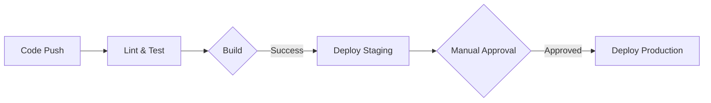

# Development Guide

## Table of Contents

1. [Getting Started](#getting-started)
2. [Development Environment](#development-environment)
3. [Coding Standards](#coding-standards)
4. [Version Control](#version-control)
5. [Testing](#testing)
6. [Documentation](#documentation)
7. [Code Review](#code-review)
8. [CI/CD Pipeline](#cicd-pipeline)
9. [Troubleshooting](#troubleshooting)
10. [Best Practices](#best-practices)

## Getting Started

### Prerequisites

- [Git](https://git-scm.com/) 2.30.0+
- [Python](https://www.python.org/) 3.9+
- [Node.js](https://nodejs.org/) 16.0+
- [Docker](https://www.docker.com/) 20.10.0+
- [VS Code](https://code.visualstudio.com/) (recommended)

### Quick Start

```bash
# Clone the repository
git clone https://github.com/your-org/knowledge-base.git
cd knowledge-base

# Set up the development environment
make setup

# Start the development server
make dev
```

## Development Environment

### Local Setup

1. **Python Environment**
   ```bash
   # Create and activate virtual environment
   python -m venv venv
   source venv/bin/activate  # On Windows: venv\Scripts\activate
   
   # Install dependencies
   pip install -r requirements-dev.txt
   ```

2. **Frontend Setup**
   ```bash
   cd frontend
   npm install
   npm run dev
   ```

### Containerized Development

```bash
# Start all services
docker-compose up -d

# Run specific service
docker-compose up -d service-name

# View logs
docker-compose logs -f
```

## Coding Standards

### General Guidelines

- Follow [PEP 8](https://www.python.org/dev/peps/pep-0008/) for Python code
- Use [Prettier](https://prettier.io/) for frontend code formatting
- Maximum line length: 88 characters (Python), 100 characters (JavaScript/TypeScript)
- Use 4 spaces for indentation (Python), 2 spaces (JavaScript/TypeScript)

### Code Organization

```
src/
├── api/              # API endpoints
├── core/             # Core functionality
├── models/           # Data models
├── services/         # Business logic
└── utils/            # Utility functions
```

## Version Control

### Branch Naming

```
<type>/<ticket>-<description>
```

**Types**:
- `feat`: New feature
- `fix`: Bug fix
- `docs`: Documentation changes
- `style`: Code style changes
- `refactor`: Code refactoring
- `test`: Adding tests
- `chore`: Maintenance tasks

### Commit Messages

```
<type>(<scope>): <subject>

[optional body]

[optional footer]
```

Example:
```
feat(auth): add OAuth2 authentication

- Implement Google OAuth2 provider
- Add login/logout endpoints
- Update documentation

Closes #123
```

## Testing

### Running Tests

```bash
# Run all tests
pytest

# Run specific test file
pytest tests/test_module.py

# Run with coverage
pytest --cov=src tests/
```

### Test Structure

```
tests/
├── unit/           # Unit tests
├── integration/    # Integration tests
└── e2e/            # End-to-end tests
```

## Documentation

### Writing Documentation

1. Use Markdown (`.md`) for all documentation
2. Follow the [Documentation Style Guide](/docs/contributing/style-guide.md)
3. Include code examples and usage instructions
4. Update `CHANGELOG.md` for notable changes

### Generating API Docs

```bash
# Generate API documentation
make docs

# Serve documentation locally
mkdocs serve
```

## Code Review

### Review Process

1. Create a pull request (PR)
2. Request reviews from at least one team member
3. Address all review comments
4. Ensure all tests pass
5. Get approval before merging

### Review Checklist

- [ ] Code follows style guidelines
- [ ] Tests are included and passing
- [ ] Documentation is updated
- [ ] No commented-out code
- [ ] No console.log statements in production code

## CI/CD Pipeline

### Workflow



### Environment Variables

| Variable | Description | Required |
|----------|-------------|----------|
| `DATABASE_URL` | Database connection string | Yes |
| `API_KEY` | API authentication key | Yes |
| `ENVIRONMENT` | Deployment environment | No |

## Troubleshooting

### Common Issues

1. **Dependency Conflicts**
   ```bash
   pip install --upgrade pip
   pip install -r requirements.txt --no-cache-dir
   ```

2. **Database Connection Issues**
   - Verify database service is running
   - Check connection string in `.env`
   - Run database migrations

3. **Frontend Build Failures**
   ```bash
   rm -rf node_modules/
   npm cache clean --force
   npm install
   ```

## Best Practices

### Code Quality

- Write small, focused functions
- Use meaningful variable and function names
- Add docstrings to public functions and classes
- Keep functions under 30 lines
- Limit function parameters to 4 or fewer

### Performance

- Use appropriate data structures
- Implement caching where needed
- Optimize database queries
- Use pagination for large datasets

### Security

- Never commit secrets or credentials
- Validate all user input
- Use parameterized queries
- Keep dependencies updated
- Implement proper error handling

## Resources

- [Python Documentation](https://docs.python.org/3/)
- [JavaScript Documentation](https://developer.mozilla.org/en-US/docs/Web/JavaScript)
- [Git Documentation](https://git-scm.com/doc)
- [Docker Documentation](https://docs.docker.com/)

## Support

For additional help, contact:
- **Engineering Team**: dev@example.com
- **Documentation Team**: docs@example.com
- **Operations Team**: ops@example.com

## Revision History

| Version | Date | Author | Changes |
|---------|------|--------|---------|
| 2.0.0 | 2025-07-05 | Engineering Team | Complete development guide |
| 1.0.0 | 2025-07-04 | System | Initial stub |
