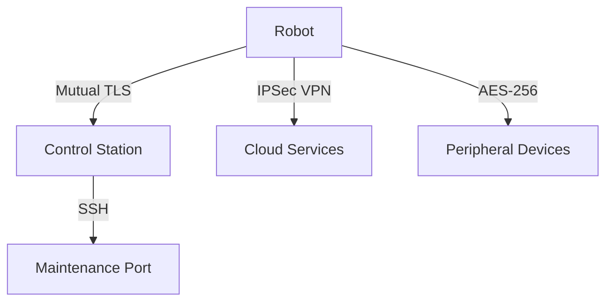

# Security Architecture

This document outlines the comprehensive security measures implemented in the advanced robotic system to protect against various threats and ensure secure operation.

## Security Layers

### 1. Physical Security

#### 1.1 Tamper Detection
- **Enclosure Security**: Sealed enclosures with tamper-evident seals
- **Intrusion Detection**: Vibration, tilt, and case open sensors
- **Secure Boot**: Hardware-based verification of boot integrity
- **Secure Element**: Dedicated hardware for cryptographic operations

#### 1.2 I/O Protection
- **Interface Disabling**: Automatic disabling of unused ports
- **Port Security**: Physical port locks and authentication
- **Cable Locks**: Theft prevention mechanisms

### 2. Network Security

#### 2.1 Secure Communication


#### 2.2 Network Protocols
- **Wireless**: WPA3-Enterprise with 802.1X authentication
- **Wired**: MACsec (IEEE 802.1AE) for all wired connections
- **VPN**: Always-on VPN with certificate-based authentication
- **Firewall**: Stateful packet inspection with application-layer filtering

### 3. Authentication & Authorization

#### 3.1 Multi-Factor Authentication
```python
class MultiFactorAuth:
    def __init__(self):
        self.factors = {
            'password': PasswordFactor(),
            'totp': TOTPFactor(),
            'biometric': BiometricFactor(),
            'hardware_token': HardwareTokenFactor()
        }
        self.required_factors = 2  # Require 2 factors
    
    def authenticate(self, user_id, credentials):
        factors_verified = 0
        
        for factor_type, factor in self.factors.items():
            if factor_type in credentials:
                if factor.verify(user_id, credentials[factor_type]):
                    factors_verified += 1
                else:
                    audit_log.failed_attempt(user_id, factor_type)
                    return False
        
        if factors_verified >= self.required_factors:
            audit_log.successful_login(user_id)
            return True
            
        return False
```

#### 3.2 Role-Based Access Control (RBAC)
```yaml
roles:
  admin:
    permissions:
      - system:shutdown
      - user:manage
      - config:update
      - log:view
      - firmware:update
  
  operator:
    permissions:
      - robot:control
      - task:create
      - task:modify
      - sensor:read
      - log:view:own
  
  guest:
    permissions:
      - sensor:read:basic
      - status:view
```

### 4. Data Protection

#### 4.1 Encryption
- **At Rest**: AES-256 with hardware-accelerated encryption
- **In Transit**: TLS 1.3 with PFS (Perfect Forward Secrecy)
- **Key Management**: HSM-backed key storage with automatic rotation

#### 4.2 Secure Storage
```python
class SecureStorage:
    def __init__(self):
        self.encryption_key = get_hardware_key()
        self.iv = os.urandom(16)
        
    def store(self, key, data):
        # Encrypt data
        cipher = AES.new(self.encryption_key, AES.MODE_GCM, nonce=self.iv)
        ciphertext, tag = cipher.encrypt_and_digest(data)
        
        # Store with integrity check
        secure_db.store(key, {
            'ciphertext': ciphertext,
            'nonce': self.iv,
            'tag': tag
        })
    
    def retrieve(self, key):
        # Retrieve and verify
        data = secure_db.retrieve(key)
        if not data:
            return None
            
        # Decrypt
        cipher = AES.new(
            self.encryption_key, 
            AES.MODE_GCM, 
            nonce=data['nonce']
        )
        
        try:
            return cipher.decrypt_and_verify(
                data['ciphertext'],
                data['tag']
            )
        except ValueError:
            # Integrity check failed
            security_alert("Tamper detected in secure storage!")
            return None
```

### 5. Secure Boot & Firmware

#### 5.1 Boot Process
1. **ROM Bootloader**: Validates signature of primary bootloader
2. **Primary Bootloader**: Verifies kernel and initramfs
3. **Kernel**: Enforces module signing and secure boot policies
4. **Root Filesystem**: dm-verity for runtime integrity checking

#### 5.2 Firmware Updates
```python
def secure_firmware_update(firmware_file, signature):
    # Verify update signature
    if not verify_signature(firmware_file, signature, TRUSTED_KEYS):
        raise SecurityError("Invalid firmware signature")
    
    # Check version
    current_ver = get_current_firmware_version()
    new_ver = extract_firmware_version(firmware_file)
    
    if new_ver <= current_ver and not ALLOW_DOWNGRADE:
        raise SecurityError("Downgrade not allowed")
    
    # Verify firmware hash
    expected_hash = get_trusted_hash(new_ver)
    if calculate_hash(firmware_file) != expected_hash:
        raise SecurityError("Firmware hash mismatch")
    
    # Apply update
    with atomic_update():
        backup_current_firmware()
        write_new_firmware(firmware_file)
        
        # Verify new firmware
        if verify_firmware_integrity():
            commit_update()
        else:
            rollback_firmware()
            raise SecurityError("Firmware verification failed after update")
```

### 6. Intrusion Detection & Prevention

#### 6.1 Anomaly Detection
```python
class AnomalyDetector:
    def __init__(self):
        self.baseline = self._establish_baseline()
        self.threshold = 3.0  # Standard deviations
        
    def detect_anomalies(self, metrics):
        anomalies = []
        
        for metric, value in metrics.items():
            baseline_mean = self.baseline[metric]['mean']
            baseline_std = self.baseline[metric]['std']
            
            # Calculate z-score
            if baseline_std > 0:
                z_score = abs((value - baseline_mean) / baseline_std)
                if z_score > self.threshold:
                    anomalies.append({
                        'metric': metric,
                        'value': value,
                        'z_score': z_score,
                        'timestamp': time.time()
                    })
        
        return anomalies
    
    def _establish_baseline(self):
        # Collect metrics during normal operation
        # and calculate statistical baselines
        baseline = {}
        metrics = collect_metrics(duration='24h')
        
        for metric, values in metrics.items():
            baseline[metric] = {
                'mean': np.mean(values),
                'std': np.std(values),
                'min': np.min(values),
                'max': np.max(values)
            }
            
        return baseline
```

### 7. Secure Development Lifecycle

#### 7.1 Code Review Process
1. **Static Analysis**: SAST tools (e.g., Semgrep, Bandit)
2. **Dependency Scanning**: OWASP Dependency-Check
3. **Code Review**: Mandatory 2-person review
4. **Security Testing**: DAST and penetration testing
5. **Threat Modeling**: STRIDE methodology

#### 7.2 Secure Coding Guidelines
- Input validation for all external inputs
- Output encoding to prevent XSS
- Parameterized queries to prevent SQLi
- Secure memory management
- Principle of least privilege
- Defense in depth

### 8. Incident Response

#### 8.1 Response Plan
1. **Detection**: SIEM alerts, IDS/IPS
2. **Containment**: Network segmentation, service isolation
3. **Eradication**: Patch vulnerabilities, remove malware
4. **Recovery**: Restore from clean backups
5. **Post-Mortem**: Root cause analysis, lessons learned

#### 8.2 Forensics
- System image capture
- Memory forensics
- Log analysis
- Chain of custody documentation

### 9. Compliance & Standards

#### 9.1 Standards Compliance
- **IEC 62443**: Industrial automation and control systems
- **NIST SP 800-82**: Industrial control systems security
- **ISO 27001**: Information security management
- **GDPR**: Data protection and privacy

### 10. Security Testing

#### 10.1 Penetration Testing
- **External Testing**: Internet-facing services
- **Internal Testing**: Network segmentation, lateral movement
- **Physical Testing**: Tamper resistance, port security
- **Social Engineering**: Phishing, tailgating tests

#### 10.2 Vulnerability Scanning
- **Weekly Scans**: Automated vulnerability assessment
- **Quarterly Audits**: Comprehensive security review
- **Continuous Monitoring**: Real-time threat detection

## Security Best Practices

### 1. Default Deny
- All network traffic is blocked by default
- Only explicitly allowed traffic is permitted
- Default user accounts are disabled

### 2. Principle of Least Privilege
- Minimal permissions for all services
- Separate administrative and operational accounts
- Regular privilege reviews

### 3. Defense in Depth
- Multiple layers of security controls
- Redundant security measures
- Compartmentalization of systems

### 4. Secure Defaults
- Strong default passwords
- Automatic security updates
- Secure configurations out-of-the-box

## Security Monitoring

### 1. SIEM Integration
- Centralized logging and monitoring
- Real-time alerting
- Correlation of security events

### 2. Behavioral Analysis
- Machine learning for anomaly detection
- User and entity behavior analytics (UEBA)
- Threat hunting capabilities

## Physical Security Controls

### 1. Secure Boot Process
1. **ROM Code**: Validates bootloader signature
2. **Bootloader**: Verifies kernel and initramfs
3. **Kernel**: Enforces module signing
4. **Root FS**: dm-verity for integrity

### 2. Hardware Security Modules (HSM)
- Secure key storage
- Cryptographic acceleration
- Tamper detection and response

## Security Training

### 1. Developer Training
- Secure coding practices
- Threat modeling
- Security code review

### 2. Operator Training
- Security best practices
- Incident response
- Physical security procedures

## Security Documentation

### 1. System Security Plan (SSP)
- System description
- Security controls
- Implementation details

### 2. Risk Assessment
- Threat modeling
- Vulnerability assessment
- Risk treatment plan

## Security Contact Information

For security-related inquiries or to report vulnerabilities, please contact:

- **Security Team**: security@example.com
- **PGP Key**: [Link to public key]
- **Security Advisories**: [Link to advisory page]

---
*Last updated: 2025-07-01*  
*Version: 1.0.0*
